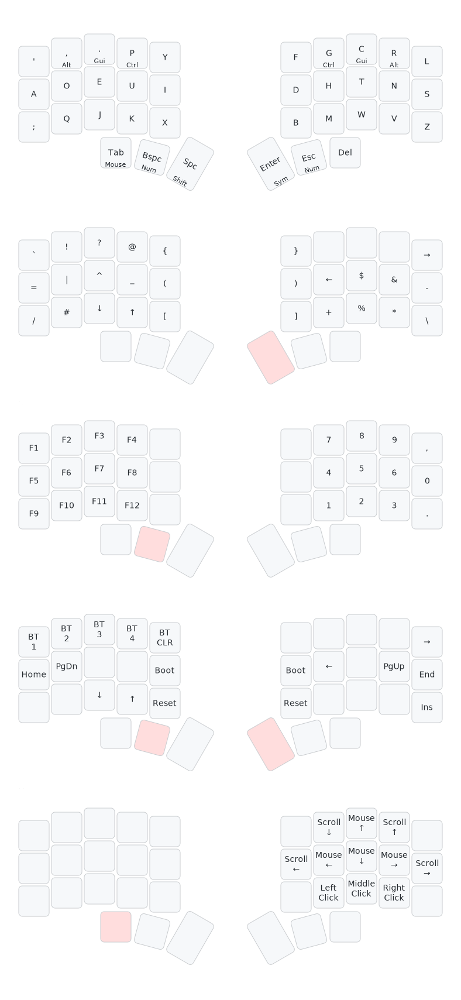

# mbwilding's zmk-config

This is my personal Corne Mini 36 key [ZMK firmware](https://github.com/zmkfirmware/zmk/) configuration.

## Layout

> Generated by: [keymap-drawer](https://github.com/caksoylar/keymap-drawer)



### Troubleshooting

- **Noticeable delay when tapping HRMs:** Increase `require-prior-idle-ms`. As a
  rule of thumb, you want to set it to at least `10500/x` where `x` is your
  (relaxed) WPM for English prose.
- **False negatives (same-hand):** Reduce `tapping-term-ms` (or disable
  `hold-trigger-key-positions`)
- **False negatives (cross-hand):** Reduce `require-prior-idle-ms` (or set
  flavor to `hold-preferred` -- to continue using `hold-trigger-on-release`, you
  must apply this
  [patch](https://github.com/celejewski/zmk/commit/d7a8482712d87963e59b74238667346221199293)
  to ZMK
- **False positives (same-hand):** Increase `tapping-term-ms`
- **False positives (cross-hand):** Increase `require-prior-idle-ms` (or set
  flavor to `tap-preferred`, which requires holding HRMs past tapping term to
  activate)

## Local build environment

I streamline my local build process using `nix`, `direnv` and `just`. This
automatically sets up a virtual development environment with `west`, the
`zephyr-sdk` and all its dependencies when `cd`-ing into the ZMK-workspace. The
environment is _completely isolated_ and won't pollute your system.

### Setup

#### Pre-requisites

1. Install the `nix` package manager:

   ```bash
   # Install Nix with flake support enabled
   curl --proto '=https' --tlsv1.2 -sSf -L https://install.determinate.systems/nix |
      sh -s -- install --no-confirm

   # Start the nix daemon without restarting the shell
   . /nix/var/nix/profiles/default/etc/profile.d/nix-daemon.sh
   ```

2. Install [`direnv`](https://direnv.net/) (and optionally but recommended
   [`nix-direnv`](https://github.com/nix-community/nix-direnv)[^4]) using your
   package manager of choice. E.g., using the `nix` package manager that we just
   installed[^5]:

   ```
   nix profile install nixpkgs#direnv nixpkgs#nix-direnv
   ```

3. Set up the `direnv` [shell-hook](https://direnv.net/docs/hook.html) for your
   shell. E.g., for `bash`:

   ```bash
   # Install the shell-hook
   echo 'eval "$(direnv hook bash)"' >> ~/.bashrc

   # Enable nix-direnv (if installed in the previous step)
   mkdir -p ~/.config/direnv
   echo 'source $HOME/.nix-profile/share/nix-direnv/direnvrc' >> ~/.config/direnv/direnvrc

   # Optional: make direnv less verbose
   echo '[global]\nwarn_timeout = "2m"\nhide_env_diff = true' >> ~/.config/direnv/direnv.toml

   # Source the bashrc to activate the hook (or start a new shell)
   source ~/.bashrc
   ```

#### Set up the workspace

1. Clone _your fork_ of this repository. I like to name my local clone
   `zmk-workspace` as it will be the toplevel of the development environment.

   ```bash
   git clone https://github.com/mbwilding/zmk-config zmk-workspace
   ```

2. Enter the workspace and set up the environment.

   ```bash
   # The first time you enter the workspace, you will be prompted to allow direnv
   cd zmk-workspace

   # Allow direnv for the workspace, which will set up the environment (this takes a while)
   direnv allow

   # Initialize the Zephyr workspace and pull in the ZMK dependencies
   # (same as `west init -l config && west update && west zephyr-export`)
   just init
   ```

### Usage

After following the steps above your workspace should look like this:

```
zmk-workspace
├── config
├── firmware (created after building)
├── modules
├── zephyr
└── zmk
```

#### Building the firmware

To build the firmware, simply type `just build` from anywhere in the
workspace. This will parse `build.yaml` and build the firmware.

#### Drawing the keymap

The build environment packages
[keymap-drawer](https://github.com/caksoylar/keymap-drawer). `just draw` parses
`base.keymap` and draws it to `draw/base.svg`.

#### Hacking the firmware

To make changes to the ZMK source or any of the modules, simply edit the files
or use `git` to pull in changes.

To switch to any remote branches or tags, use `git fetch` inside a module
directory to make the remote refs locally available. Then switch to the desired
branch with `git checkout <branch>` as usual. You may also want to register
additional remotes to work with or consider making them the default in
`config/west.yml`.

#### Updating the build environment

To update the ZMK dependencies, use `just update`. This will pull in the latest
version of ZMK and all modules specified in `config/west.yml`. Make sure to
commit and push all local changes you have made to ZMK and the modules before
running this command, as this will overwrite them.

To upgrade the Zephyr SDK and Python build dependencies, use `just upgrade-sdk`. (Use with care --
Running this will upgrade all Nix packages and may end up breaking the build environment. When in
doubt, I recommend keeping the environment pinned to `flake.lock`.
